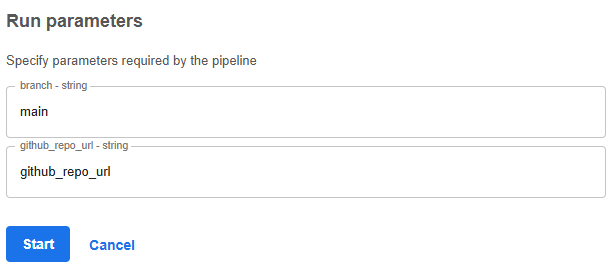

# REALM Task 5.1 Post-Market Evaluation - STAR Use Case

## General Task Description

Components developed in Task 5.1 focus on the post-market evaluation of synthetically generated medical data that are used in various medical applications such as lung tumor segmentation, pharmacogenomics, COPD prediction, blood glucose prediction, etc.

The post-market evaluation is performed to ensure that the synthetic data generated is of high quality and is similar to the real data. To evaluate the quality of the synthetic data, examination along three main axes is performed:

1. **Expert Knowledge**: Evaluates the synthetic data based on domain-specific rules and medical knowledge to ensure anatomical correctness and clinical validity.
2. **Statistical Analysis**: Examines statistical and distributional properties of the synthetic data to ensure their validity from a statistical standpoint.
3. **Adversarial Evaluation**: Compares the performance of SOTA machine/deep learning models on the synthetic data with their performance on the real data to ensure that the two datasets (real and synthetic) yield comparable results.

## Use Case 3 Specific Description

This repository implements a comprehensive post-market evaluation pipeline for synthetic STAR (Stochastic TARgeted model for blood glucose control) time-series data, analyzing their quality and similarity to real-world clinical data through three distinct evaluation approaches.

**Key Components:**

- **Expert Knowledge Evaluation**: Validates synthetic clinical data against established medical ranges and physiological constraints based on comprehensive clinical literature. The evaluation checks two critical criteria:
    - **Criterion 1 - Blood Glucose Ranges**: All blood glucose values must fall within the humanly plausible range of [1.2, 110] mmol/L according to Barry (2020) [1] and Manappallil (2017) [2]. This range accounts for extreme hypoglycemia (below 2.8 mmol/L) to severe hyperglycemia (above 30 mmol/L), covering the full spectrum of clinically observed blood glucose levels.
    - **Criterion 2 - Subcutaneous Insulin Administration**: According to Walsh et al. (2014) [3], subcutaneous insulin (route=1) should not have been administered in the 12 hours prior to the evaluation time point. This accounts for the duration of insulin action, which can extend 6+ hours after administration, ensuring the 6-hour evaluation window is not influenced by prior subcutaneous doses.

- **Statistical Analysis**: Conducts comprehensive data quality assessment on patient JSON files containing blood glucose, insulin, and nutrition time-series data. The analysis performs four critical checks:
    - **Check 1 - Required Fields**: Validates presence of essential fields (diabeticStatus, startTime, bloodGlucose, insulinInfusion, insulinBolus, nutritionInfusion, nutritionBolus) required for model predictions.
    - **Check 2 - IV Rate Validity**: Ensures both IV insulin and nutrition infusion rates are never simultaneously zero, as patients require continuous nutritional or insulin support.
    - **Check 3 - Diabetic Status Validation**: Confirms diabeticStatus values are within valid range (0=non-diabetic, 1=Type 1 diabetes, 2=Type 2 diabetes).
    - **Check 4 - Measurement Frequency**: Verifies at least 3 blood glucose measurements exist in the 6-hour window prior to evaluation, ensuring sufficient data density for accurate predictions.

- **Adversarial Evaluation**: Compares STAR model performance between real-world and synthetic data using the STAR API for blood glucose interval predictions. The evaluation assesses:
    - **Coverage Rate**: Percentage of ground truth blood glucose values falling within predicted intervals (BG5TH to BG95TH), indicating model calibration quality.
    - **MAE (Mean Absolute Error)**: Average absolute difference between predicted interval midpoints and ground truth values, measuring point prediction accuracy.
    - **RMSE (Root Mean Squared Error)**: Square root of average squared errors, penalizing larger prediction errors more heavily.
    - **MAPE (Mean Absolute Percentage Error)**: Average percentage error normalized by ground truth values, enabling comparison across different blood glucose scales.
    
    Small differences between real-world and synthetic metrics indicate the synthetic data successfully captures real-world patterns and can serve as a valid substitute for model evaluation.

## Prerequisites

1. Python version must be 3.14.
2. Create a virtual environment and install the dependencies using the [requirements.txt](./requirements.txt) file: `pip install -r requirements.txt`.
3. API access to the STAR model endpoint at `https://demo.insilicare.com/api/star/REALM/validation`.

## Data Structure

The STAR model works with time-series patient data in JSON format containing blood glucose measurements, insulin administration, and nutritional intake over time. Each patient file represents a clinical episode with temporal sequences of physiological measurements and interventions.

### Input Data Format

The input data is expected to be in JSON format with the following structure:

```json
{
  "__class": "star.algo.data.Patient",
  "hospitalID": "patient_545",
  "updateTime": 1584555782000,
  "episodes": [
    {
      "__class": "star.algo.data.Episode",
      "age": 45,
      "gender": true,
      "diabeticStatus": 1,
      "bloodGlucose": [
        [1584554400000, 11.111111111111111],
        [1584555782000, 7.7777777777777777],
        [1584556520000, 8.2222222222222214]
      ],
      "insulinInfusion": [
        [1584550920000, {
          "__class": "star.algo.data.Infusion$Insulin",
          "date": 1584550920000,
          "route": 0,
          "rate": 3.50029374,
          "concentration": 1
        }]
      ],
      "insulinBolus":[],
      "nutritionInfusion": [
        [1584541800000, {
          "__class": "star.algo.data.Infusion$Nutrition",
          "date": 1584541800000,
          "fatConcentration": 49,
          "carbsConcentration": 141,
          "calories": 1.28,
          "rate": 0
        }],
      ],
      "nutritionBolus":[],
    }
  ]
}
```

**Key Fields:**
- `hospitalID`: Unique patient identifier
- `updateTime`: Unix epoch timestamp (milliseconds) representing the model's prediction start time
- `bloodGlucose`: Array of [timestamp, glucose_value] pairs in mmol/L
- `insulinInfusion`: Time-series of insulin infusion data with route (0=IV, 1=subcutaneous) and rate
- `nutritionInfusion`: Time-series of nutritional intake data
- `diabeticStatus`: Patient diabetes type (0=non-diabetic, 1=Type 1, 2=Type 2)
- `nutritionBolus`: Nutritional bolus records

In the json data, ohter fileds are also present, but these are used from the model in order to predict the blood glucose level values.

## Running the STAR Model

The STAR model is accessible via a REST API endpoint. The API predicts blood glucose evolution ranges based on patient data.

### API Endpoint
```
POST https://demo.insilicare.com/api/star/REALM/validation
```

### Example Request

```bash
curl -X POST https://demo.insilicare.com/api/star/REALM/validation \
  -H "Content-Type: application/json" \
  -d '{
  "patient": {
    "__class": "star.algo.data.Patient",
    "hospitalID": "386_854_935",
    "updateTime": 1584555782000,
    "episodes": [...]
  },
  "predictionTime": 1584556520000
}'
```

### Example Response

```json
{
  "BG5TH": 7.196445581533928,
  "BG95TH": 17.42121412769019
}
```

**Response Fields:**
- `BG5TH`: Lower bound (5th percentile) of predicted blood glucose range at predictionTime
- `BG95TH`: Upper bound (95th percentile) of predicted blood glucose range at predictionTime

The prediction interval [BG5TH, BG95TH] represents the model's confidence range for blood glucose at the specified future time point, starting from the patient's `updateTime`.

## Post-Market Evaluation Report

Each evaluation component can be executed independently.

### Expert Knowledge Evaluation

Validates synthetic data against clinical physiological ranges using [src/expert_knowledge.py](./src/expert_knowledge.py):

```bash
python src/expert_knowledge.py \
    --synth_dir /path/to/synthetic_patients \
    --output output/expert_knowledge_evaluation_results.json
```

**Arguments:**
- `--synth_dir`: Path to directory containing synthetic patient JSON files.
- `--output`: Output JSON file path (default: `output/expert_knowledge_results.json`).

**Output Format:**
```json
{
  "criterion_1": {
    "information": "The valid humanly plausible ranges for blood glucose are [1.2, 110] mmol/L according to Barry (2020) and Manappallil (2017)",
    "patient_001.json": {
      "valid": true,
      "invalid_values": []
    },
    "patient_002.json": {
      "valid": false,
      "invalid_values": [
        {
          "timestamp": "2020-03-18T16:30:00",
          "glucose_value": 125.5
        }
      ]
    }
  },
  "criterion_2": {
    "information": "According to Walsh et. al. (2014), subcutaneous insulin may not have been administered in the last 6 hours prior the period considered (so 12hours before the time of evaluation)",
    "patient_002.json": {
      "valid": true,
      "invalid_administrations": []
    },
    "patient_003.json": {
      "valid": false,
      "invalid_administrations": [
        {
          "timestamp": "2020-03-18T10:00:00",
          "type": "infusion",
          "route": 1
        }
      ]
    }
  }
}
```

### Statistical Analysis

Performs comprehensive data quality assessment using [src/statistical_analysis.py](./src/statistical_analysis.py):

```bash
python src/statistical_analysis.py \
    --synth_dir /path/to/synthetic_patients \
    --output output/statistical_analysis_results.json
```

**Arguments:**
- `--synth_dir`: Path to directory containing synthetic patient JSON files.
- `--output`: Output JSON file path (default: `output/statistical_analysis_results.json`).

**Output Format:**
```json
{
  "check_1": {
    "information": "Required fields exist (diabeticStatus, startTime, bloodGlucose, insulinInfusion, insulinBolus, nutritionInfusion, nutritionBolus)",
    "patient_001.json": {
      "valid": true,
      "missing_fields": []
    },
    "patient_002.json": {
      "valid": false,
      "missing_fields": ["diabeticStatus", "nutritionBolus"]
    }
  },
  "check_2": {
    "information": "Both IV insulin and nutrition rates cannot be null at the same time",
    "patient_001.json": {
      "valid": false,
      "invalid_periods": [
        {
          "timestamp": "2020-03-18T16:30:00",
          "insulin_rate": 0,
          "nutrition_rate": 0
        }
      ]
    }
  },
  "check_3": {
    "information": "diabeticStatus has a valid value (0,1,2)",
    "patient_001.json": {
      "valid": true,
      "invalid_statuses": []
    }
  },
  "check_4": {
    "information": "At least 3 blood glucose measurements in the last 6 hours",
    "patient_001.json": {
      "valid": true,
      "measurement_counts": [
        {
          "window_start": "2020-03-18T21:00:00",
          "window_end": "2020-03-19T03:00:00",
          "count": 5
        }
      ]
    }
  }
}
```

### Adversarial Evaluation

Compares STAR model performance between synthetic and real-world data using [src/adversarial_evaluation.py](./src/adversarial_evaluation.py):

```bash
python src/adversarial_evaluation.py \
    --synth_dir /path/to/synthetic_patients \
    --rwd_dir /path/to/real_patients \
    --output output/adversarial_evaluation_results.json
```

**Arguments:**
- `--synth_dir`: Path to directory containing synthetic patient JSON files.
- `--rwd_dir`: Path to directory containing real-world patient JSON files.
- `--output`: Output JSON file path (default: `output/adversarial_evaluation_results.json`).

**Output Format:**
```json
{
  "information": "Adversarial evaluation comparing STAR model performance on real-world data (RWD) versus synthetic data...",
  "Coverage Rate": {
    "rwd": "60.0pp",
    "synthetic": "60.0pp",
    "difference": "0.0pp"
  },
  "MAE": {
    "rwd": 1.8721,
    "synthetic": 0.9903,
    "difference": "0.8817"
  },
  "RMSE": {
    "rwd": 2.2421,
    "synthetic": 1.0491,
    "difference": "1.1929"
  },
  "MAPE": {
    "rwd": "35.6pp",
    "synthetic": "11.98pp",
    "difference": "23.62pp"
  }
}
```

### Understanding the Results

#### Expert Knowledge Evaluation Output
The expert knowledge evaluation validates synthetic data against clinically acceptable physiological ranges:
- **Criterion 1 - Blood Glucose Ranges**: For each patient file, reports whether all blood glucose values fall within [1.2, 110] mmol/L. Invalid values include their timestamps and actual glucose measurements that exceed physiological limits.
- **Criterion 2 - Subcutaneous Insulin**: For each patient file, reports whether subcutaneous insulin (route=1) was incorrectly administered in the 12-hour window prior to evaluation. Invalid administrations include timestamps, type (infusion/bolus), and route information.
- **Valid Files**: Files passing both criteria indicate physiologically plausible synthetic patient trajectories.

#### Statistical Analysis Output
The statistical analysis provides comprehensive data quality assessment across four checks:
- **Check 1 - Required Fields**: Identifies files missing essential fields needed for STAR model predictions. Missing fields prevent proper model evaluation.
- **Check 2 - IV Rate Validity**: Reports time periods where both insulin and nutrition rates are zero, which is clinically implausible for ICU patients requiring continuous support.
- **Check 3 - Diabetic Status**: Validates that diabetic status values are within the valid set (0, 1, 2). Invalid values indicate data generation errors.
- **Check 4 - Measurement Frequency**: Reports the count of blood glucose measurements in the 6-hour evaluation window for each patient. Counts below 3 indicate insufficient data density for reliable predictions.

#### Adversarial Evaluation Output
The adversarial evaluation compares STAR model prediction quality between real-world and synthetic data:
- **Coverage Rate**: Percentage of ground truth values falling within predicted intervals. Higher coverage indicates better-calibrated predictions. A 60% coverage rate means the model successfully captures 60% of actual blood glucose values within its prediction bounds.
- **MAE (Mean Absolute Error)**: Average absolute difference between interval midpoints and ground truth. Lower MAE indicates more accurate point predictions. Values are in mmol/L units matching blood glucose measurements.
- **RMSE (Root Mean Squared Error)**: Penalizes larger errors more heavily than MAE. Lower RMSE indicates fewer extreme prediction errors. Values are in mmol/L units.
- **MAPE (Mean Absolute Percentage Error)**: Percentage error normalized by ground truth values. Lower MAPE indicates better relative accuracy across different blood glucose ranges. A 35.6% MAPE means predictions deviate by approximately 36% from actual values on average.
- **Performance Differences**: Shows the absolute difference between real-world and synthetic metrics. Small differences indicate the synthetic data successfully captures real-world patterns. Large differences suggest distribution mismatch between synthetic and real data.


## Kubeflow Pipeline Component

The [kubeflow_component/star_post_market_component.py](./kubeflow_component/star_post_market_component.py) file defines a Kubeflow pipeline for automating the STAR post-market evaluation workflow. This pipeline orchestrates the following components:

- **Download Component**: Downloads project files and datasets from a specified GitHub repository and branch. The pipeline expects:
  - **Scripts**: The repository should contain Python evaluation scripts in the `src/` directory:
    - `expert_knowledge.py` - Clinical validation against medical ranges
    - `statistical_analysis.py` - Data quality assessment
    - `adversarial_evaluation.py` - Model performance comparison
    - `STAR_model.py` - STAR API wrapper
    - `utils/` directory with helper functions (`generic_utils.py`, `data_helpers.py`, `time_conversion.py`)
  - **Data**: The `data/` folder should contain two subdirectories:
    - `synthetic_data/` - Directory with synthetic patient JSON files
    - `rwd_data/` - Directory with real-world patient JSON files
  
- **Expert Knowledge Evaluation**: Executes clinical validation against physiological ranges for all synthetic patient files.
- **Statistical Analysis**: Performs comprehensive data quality assessment on all synthetic patient files.
- **Adversarial Evaluation**: Compares STAR model performance between synthetic and real-world patient data using API calls.

### Pipeline Architecture


The pipeline follows this execution pattern:
1. **Sequential Phase**: Repository download runs first, copying all required scripts and data.
2. **Parallel Phase**: All three evaluation components (expert knowledge, statistical analysis, adversarial evaluation) run simultaneously after repository download completes, maximizing computational efficiency.

### Running the Pipeline

The pipeline can be compiled and deployed to a Kubeflow environment by executing:

```bash
python kubeflow_component/star_post_market_component.py
```

This generates `star_post_market_pipeline.yaml` which can be uploaded to Kubeflow.

The generated YAML file can be used to create a new pipeline in Kubeflow by uploading the file through the Kubeflow UI.

The Kubeflow UI expects the following pipeline run parameters (arguments) when running:
- `github_repo_url`: URL of the GitHub repository containing evaluation scripts and patient data directories.
- `branch`: Git branch to use (default: `main`).



### Accessing Pipeline Results

Pipeline artifacts are stored in MinIO object storage within the Kubeflow namespace. To access these artifacts:

1. Set up port forwarding to the MinIO service by running: `kubectl port-forward -n kubeflow svc/minio-service 9000:9000`.
2. Access the MinIO web interface at `http://localhost:9000`.
3. Login with the default credentials: username: `minio`, password: `minio123`.
4. Navigate to the `mlpipeline` bucket, where you'll find the generated folders and files from each pipeline step, organized by the automatically assigned pipeline UUID. (An example location could be: `http://localhost:9000/minio/mlpipeline/v2/artifacts/star-post-market-evaluation-pipeline/b2b94d5f-2cde-489e-a7f0-60b6bc93f6df/`)

Each evaluation component creates a separate output artifact containing its respective JSON results file.

## References

### Expert Knowledge Evaluation Sources:
1. Barry, Arden R. "Severe hypoglycemia in a patient with type 1 diabetes mellitus recently started on sacubitril/valsartan: a case report." CJC open 2.3 (2020): 176-178. [ref. here](https://pmc.ncbi.nlm.nih.gov/articles/PMC7242494/)
2. Gopalakrishnan, M., Manappallil, R. G., Ramdas, D., & Jayaraj, J. (2017). The survival story of a diabetic ketoacidosis patient with blood sugar levels of 1985 mg/dL. Asian Journal of Medical Sciences, 8(4), 60-61. [ref. here](http://researchgate.net/publication/317551782_The_survival_story_of_a_diabetic_ketoacidosis_patient_with_blood_sugar_levels_of_1985_mgdL)
3. Walsh, John, Ruth Roberts, and Lutz Heinemann. "Confusion regarding duration of insulin action: a potential source for major insulin dose errors by bolus calculators." Journal of diabetes science and technology 8.1 (2014): 170-178. [ref. here](https://www.researchgate.net/publication/262787177_Confusion_Regarding_Duration_of_Insulin_Action_A_Potential_Source_for_Major_Insulin_Dose_Errors_by_Bolus_Calculators)

## 📜 License & Usage

All rights reserved by MetaMinds Innovations.
